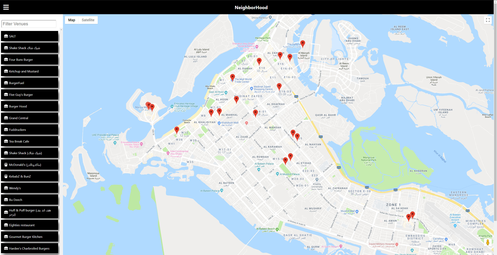

# NeighborHood Map Project ~ Café in Abu Dhabi 

## What is this project?
- It is a project from Udacity in the Front-End Developer NanoDegree. This project shows a map of a neighborhood and some marks on the map that shows the cafes in that neighborhood. An input filter for the cafes is also available and by clicking on the marker or the name of the cafe you'll get some information about that specific cafe.

## Libraries, and APIs used

1. Google Maps
2. Foursquare
3. Fontawsome
4. React.js
5. google-maps-react library

## Requirements and Features
- Display map markers identifying at least 5 locations that you are interested in within chosen neighborhood. Your app displays those locations by default when the page is loaded.
- Implement a list view of the set of locations.
- Provide a filter option that uses an input field to filter both the list view and the map markers displayed by default on load. The list view and the markers update accordingly.
- Add functionality using third-party APIs to provide information when a map marker or list view entry is clicked.
- Add functionality to animate a map marker when either the list item associated with it or the map marker itself is selected.
- Add functionality to open an infoWindow when either a location is selected from the list view or its map marker is selected directly.
- The app's interface is intuitive to use. For example, the input text area to filter locations is easy to locate. It should be easy to understand what set of locations is being filtered.
- Google maps and Foursquare errors are handled gracefully.

## Getting Started
- Download the project as a zip file or clone down the repository.
- install `npm install` if you dont have the recent node version.
- Navigate to the repository's root in the terminal. 
- run `npm run start` and another window in the browser will open which contains the App, and if it doesnt you could navigate to http://localhost:3000/ in your browser.